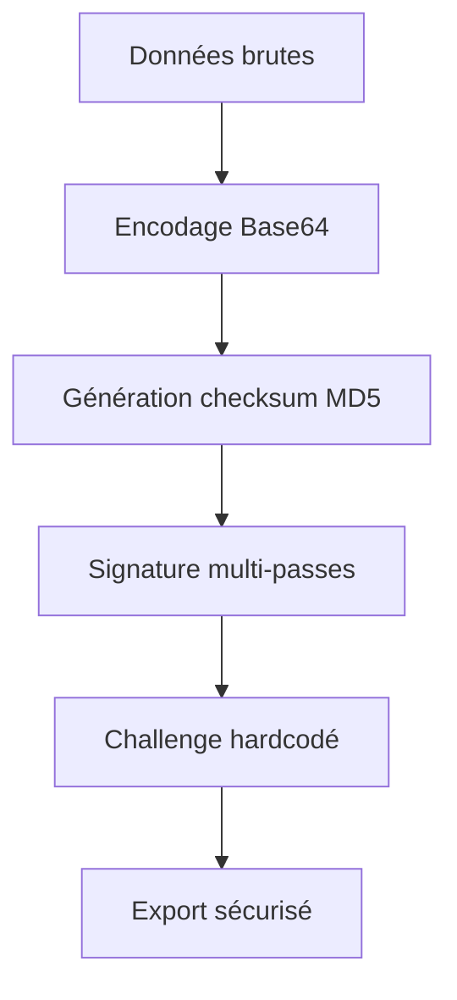

#  AuberdineExporter

**Addon WoW Classic Era pour exporter vos recettes, métiers et réputations vers auberdine.eu**

<br clear="left"/>

---

## 🎯 Vue d'ensemble

AuberdineExporter est un addon sécurisé pour **World of Warcraft Classic Era** qui permet d'exporter toutes vos données de personnages (recettes, métiers, skills, réputations) vers [auberdine.eu](https://auberdine.eu) avec une validation cryptographique robuste.

<div align="center">
  
</div>

## ✨ Fonctionnalités principales

<table>
<tr>
<td>

### 🏗️ **Export multi-personnages**
Exportez tous vos alts en un seul fichier sécurisé

### 🔒 **Sécurité renforcée** 
Format Base64 avec signature cryptographique multi-passes

### 📊 **Données complètes**
Recettes, métiers, skills, réputations, niveaux

</td>
<td>

### 🎮 **Interface intuitive**
Bouton minimap élégant + interface moderne

### ⚡ **Performance optimisée**
Export rapide et validation fiable

### 🌍 **Support multilingue**
Français, Anglais, compatibilité toutes locales

</td>
</tr>
</table>

## 🚀 Installation rapide

### Téléchargement direct
1. 📥 **Téléchargez** la [dernière version](https://github.com/yokoul/auberdine-exporter/releases)
2. 📂 **Décompressez** dans `World of Warcraft/_classic_era_/Interface/AddOns/`
3. 🔄 **Redémarrez** WoW Classic Era
4. ✅ **Terminé !** Le bouton apparaît sur votre minimap

### Via Git (développeurs)
```bash
cd "World of Warcraft/_classic_era_/Interface/AddOns/"
git clone https://github.com/yokoul/auberdine-exporter.git AuberdineExporter
```

## 📖 Guide d'utilisation

### 🎮 Interface utilisateur

| Action | Méthode |
|--------|---------|
| **Ouvrir l'interface** | Clic gauche sur le bouton minimap |
| **Menu contextuel** | Clic droit sur le bouton minimap |
| **Scanner les métiers** | Ouvrir les fenêtres de métiers (touche P) |
| **Exporter** | Bouton "Exporter Données" |

### ⌨️ Commandes slash

```bash
/auberdine              # Ouvre l'interface principale
/auberdine export       # Lance l'export immédiatement  
/auberdine clear        # Nettoie les données (garde le personnage actuel)
/auberdine size         # Affiche la taille des données stockées
/auberdine reset        # Remet à zéro toutes les données
/auberdine help         # Affiche l'aide complète
```

### 🗂️ Gestion intelligente des données

> **💡 Astuce :** Les exports volumineux (>50KB) peuvent échouer. Utilisez le nettoyage sélectif !

- **🧹 Nettoyage sélectif** : Garde le personnage actuel, supprime les autres
- **📏 Vérification de taille** : Surveille l'espace utilisé par personnage  
- **⚠️ Alertes automatiques** : Avertissement si les données deviennent trop lourdes
- **🎛️ Interface de gestion** : Boutons dédiés dans l'interface

### 📤 Processus d'export

1. **🔍 Scanner** : Ouvrez toutes vos fenêtres de métiers pour déclencher le scan automatique
2. **📋 Exporter** : Cliquez sur "Exporter Données" dans l'interface
3. **📄 Copier** : Sélectionnez et copiez le texte généré (Ctrl+C)
4. **🌐 Importer** : Collez sur [auberdine.eu/import](https://auberdine.eu/import)

## � Sécurité avancée

AuberdineExporter implémente un **système de validation cryptographique de niveau enterprise** :

### 🛡️ Protection multi-couches



### 🔑 Algorithmes de sécurité

| Composant | Méthode | Description |
|-----------|---------|-------------|
| **Encodage** | Base64 | Évite les corruptions de formatage |
| **Intégrité** | MD5 multi-passes | Détection de falsification |
| **Authentication** | Challenge/Nonce | Protection contre les replays |
| **Validation** | Signature temporelle | Horodatage sécurisé |

### 📋 Format d'export
```json
{
  "metadata": {
    "addon": "AuberdineExporter",
    "version": "1.3.1",
    "clientKey": "auberdine-v1",
    "challenge": "auberdine-2025-recipe-export"
  },
  "dataBase64": "eyJjaGFyYWN0ZXJzIjp7Li4u",
  "signature": "69ecbe7214f39518a2f1dd05ef0e1ece",
  "validation": {
    "dataChecksum": "3a1dd05ef0e1ece7",
    "algorithm": "multi-pass-md5-base64",
    "exportComplete": true
  }
}
```

## 🛠️ Architecture technique

### 📁 Structure du projet
```
AuberdineExporter/
├── 🎮 AuberdineExporter.lua     # Moteur principal
├── 📋 AuberdineExporter.toc     # Manifeste WoW
├── 🎨 UI/                       # Interface utilisateur
│   ├── AuberdineMainFrame.lua   # Interface principale  
│   ├── AuberdineExportFrame.lua # Fenêtre d'export
│   ├── AuberdineMinimapButton.lua # Bouton minimap
│   └── Icons/                   # Ressources graphiques
├── 📚 Libs/                     # Bibliothèques tierces
│   ├── LibStub/                 # Gestionnaire de libs
│   └── LibRecipes-3.0/          # Base de données recettes
├── ⚙️ server/                   # Validation côté serveur
└── 📖 docs/                     # Documentation
```

### 🧪 Système de validation serveur

Le dossier `/server` contient un écosystème **Node.js** complet :

```bash
cd server/
node verifyBase64Export.js export.json    # ✅ Valider un export
node test-base64-system.js                # 🧪 Tests automatisés  
node debug-signature.js                   # 🔍 Debug signatures
```

**📚 Documentation serveur complète** : [server/README.md](./server/README.md)

## 📚 Documentation complète

| 📄 Document | 📝 Description |
|-------------|----------------|
| [📥 INSTALLATION.md](./docs/INSTALLATION.md) | Guide d'installation détaillé |
| [🎮 USAGE.md](./docs/USAGE.md) | Manuel d'utilisation complet |
| [🔒 SECURITY.md](./docs/SECURITY.md) | Détails sécurité et cryptographie |
| [⚙️ server/README.md](./server/README.md) | Documentation serveur Node.js |
| [🌐 server/API.md](./server/API.md) | Spécifications techniques API |

## 🧪 Tests et validation

### 🎮 Tests en jeu
1. ✅ Installation et chargement de l'addon
2. 🔍 Scanner plusieurs personnages avec différents métiers
3. 📤 Export et validation sur auberdine.eu
4. 🧹 Test des fonctions de nettoyage

### ⚙️ Tests serveur automatisés
```bash
cd server/
npm install                                # 📦 Installation dépendances
npm test                                   # 🧪 Suite de tests complète
node test-base64-system.js                # 🔍 Tests approfondis
node test-base64-system.js export.json    # 📋 Analyser un export spécifique
```

## 🔄 Historique des versions

### 🚀 Version actuelle : **1.3.1** (Interface française)
- ✅ Interface entièrement traduite en français
- ✅ Amélioration de l'ergonomie et du centrage
- ✅ Icône de fond ab256 dans la zone de texte
- ✅ Correction des conflits de nommage UI
- ✅ Boutons mieux espacés et fonctionnels

### 📈 Roadmap
| Version | Statut | Fonctionnalités |
|---------|--------|-----------------|
| **1.3.1** | ✅ **Actuelle** | Interface française, UX améliorée |
| **1.3.0** | ✅ Stable | Format Base64 sécurisé |
| **1.2.x** | 🗃️ Legacy | Format JSON (déprécié) |
| **1.4.0** | 🚧 Prévue | Synchronisation cloud, backup auto |

## 🤝 Contribution

### 💡 Comment contribuer

1. 🍴 **Fork** le projet sur GitHub
2. 🌿 **Créez** une branche feature (`git checkout -b feature/SuperFeature`)
3. ✏️ **Développez** votre fonctionnalité avec tests
4. 📝 **Commitez** vos changements (`git commit -m 'Add SuperFeature'`)
5. 📤 **Pushez** sur la branche (`git push origin feature/SuperFeature`)
6. 🔄 **Ouvrez** une Pull Request

### 🎯 Domaines de contribution

- � **Correction de bugs** et optimisations
- 🌍 **Traductions** (autres langues que FR/EN)
- 🎨 **Améliorations UI/UX**
- 📚 **Documentation** et guides
- 🧪 **Tests** et validation

## 📞 Support et communauté

<table>
<tr>
<td align="center">
  
  <br />
  <strong>GitHub Issues</strong>
  <br />
  <a href="https://github.com/yokoul/auberdine-exporter/issues">Signaler un bug</a>
</td>
<td align="center">
  
  <br />
  <strong>Discord</strong>
  <br />
  <a href="https://discord.gg/auberdine">Rejoindre la communauté</a>
</td>
<td align="center">
  
  <br />
  <strong>Forum Auberdine</strong>
  <br />
  <a href="https://auberdine.eu/forum">Discussions</a>
</td>
</tr>
</table>

## 📜 Licence et remerciements

### 📋 Licence
Ce projet est sous **licence MIT**. Voir [LICENSE](./LICENSE) pour plus de détails.

### 🏆 Remerciements spéciaux

- **🏛️ LibRecipes-3.0** - Base de données exhaustive des recettes WoW Classic
- **👥 Communauté Auberdine** - Tests, feedback et contributions inestimables  
- **🎮 Blizzard Entertainment** - World of Warcraft Classic Era
- **💻 Communauté open source** - Bibliothèques et outils utilisés

---

<div align="center">

**Fait avec ❤️ pour la communauté WoW Classic Era**

[](https://auberdine.eu)
[](https://discord.gg/auberdine)
[](https://github.com/yokoul/auberdine-exporter)


**Version 1.3.1** • **WoW Classic Era** • **2025**

</div>
