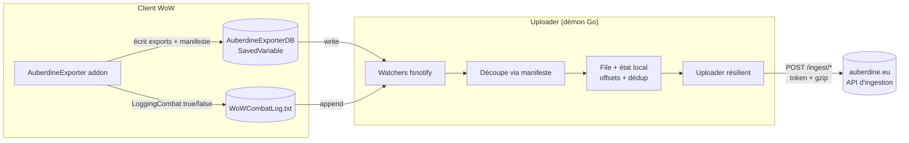

# Uploader local Auberdine — Document d'architecture

> Statut : **proposé** · Cible : démon léger multi-OS de transmission des exports
> et des logs de combat de donjon vers auberdine.eu · Branche de travail :
> `claude/local-uploader-dungeon-logs-AcBfK`

Ce document fige la vision et les décisions structurantes **avant**
implémentation. Il sert de référence partagée pour le travail côté uploader
**et** côté addon (`AuberdineExporter.lua`).

---

## 1. Contexte et périmètre

Aujourd'hui, le transfert vers auberdine.eu est **manuel** : l'addon écrit ses
données dans la SavedVariable `AuberdineExporterDB`, l'utilisateur copie une
chaîne Base64 signée et la colle sur `auberdine.eu/import`. Les **logs de
combat**, eux, ne passent pas par l'addon : le client WoW les écrit dans
`Logs/WoWCombatLog.txt`.

L'uploader local automatise ces deux flux.

### Ce que l'uploader **est**

Un **pont mince** disque → serveur : il détecte, découpe ce qui est pertinent
pour Auberdine, transmet, et n'oublie pas ce qui est déjà parti.

### Ce que l'uploader **n'est pas**

Il ne faut pas le confondre avec le **client Electron**, qui est un projet
distinct, plus complexe, doté de son propre logger, visant un traitement local
**complet** de toute l'activité. L'uploader ne réimplémente aucun moteur
d'analyse : tout le « sens » (DPS, heals, mécaniques) reste **côté
auberdine.eu**.

| | Client Electron (autre projet) | **Uploader Auberdine** (ce doc) |
|---|---|---|
| Finalité | Traitement local complet de l'activité | **Transmettre** exports + logs de donjon |
| Logger | Le sien, propriétaire | Consomme l'existant (`WoWCombatLog.txt` + SavedVariable) |
| Portée | Large, autonome | Étroite, mince |
| Rôle | Maître des données | Simple pont disque → serveur |

---

## 2. Objectifs et non-objectifs

### Objectifs

1. **Installation triviale** sans coût de certificat/notarisation (projet
   bénévole) — une ligne à copier-coller depuis le site.
2. **Démon léger** : aucune action de sync manuelle après les sessions.
3. **Multi-OS** : Windows, macOS, Linux.
4. **Empreinte quasi nulle** à l'idle.
5. **Maintenance minimale** pour un mainteneur unique.

### Non-objectifs

- Pas d'analyse métier des logs (déléguée au serveur).
- Pas de base de données locale riche de l'activité.
- Pas d'interface graphique d'exploration (au mieux, des commandes d'état).
- Pas d'auto-updater maison (délégué aux gestionnaires de paquets).

---

## 3. Décisions d'architecture

| # | Décision | Rationale |
|---|----------|-----------|
| D1 | **Binaire unique en Go** | Cross-compilation native sans runtime à installer chez l'utilisateur ; un seul langage, une seule matrice CI. |
| D2 | **Distribution par gestionnaires de paquets** (Homebrew / Scoop / winget / AUR / systemd-user) | Déporte la *confiance* sur le dépôt plutôt que sur un certificat payant → contourne Gatekeeper/SmartScreen gratuitement. |
| D3 | **Pas de signature de code ni de notarisation** | Coûts (Apple 99 $/an, Authenticode OV/EV) hors contexte pour un projet bénévole ; les managers retirent la quarantaine. |
| D4 | **Démon léger, événementiel** (fsnotify/inotify) | 0 % CPU à l'idle ; ne se réveille que sur écriture des fichiers surveillés → actif de facto seulement pendant/après les sessions. |
| D5 | **Autostart délégué au manager** (`brew services`, systemd `--user`, tâche planifiée) | Pas de service installer maison → supprime la principale source de tickets de support multi-OS. |
| D6 | **Découpage des runs piloté par l'addon** | L'addon connaît le contexte (donjon, groupe, boss) ; l'uploader reste « bête » et ne re-parse jamais le log entier. |
| D7 | **Mise à jour déléguée au manager** (`brew upgrade`, `scoop update`) | Évite un updater maison, qui ré-imposerait de la signature. |
| D8 | **CLI assumée** (public à l'aise avec une commande) | Le copier-coller d'une commande depuis un site n'est plus un frein aujourd'hui ; ouvre la porte à un wrapper graphique ultérieur si la demande/le financement suivent. |

---

## 4. Vue d'ensemble du flux



Principe directeur : **l'intelligence du découpage vit dans l'addon** ; le démon
ne fait que trancher le log aux offsets fournis et transmettre.

---

## 5. Composants du démon

Responsabilité unique : **watcher → découpe → upload résilient**. Rien d'autre.

1. **Discovery** — localise les installations WoW, comptes et réalms.
   - Auto-détection par OS (voir §8) + **override manuel toujours possible**
     (pointer vers le dossier WoW).
   - Gère le multi-compte / multi-réalm
     (`WTF/Account/<ACCOUNT>/SavedVariables/`).
2. **Watchers** — surveillance événementielle.
   - `AuberdineExporter.lua` : relu à chaque write.
   - `WoWCombatLog.txt` : **lecture incrémentale par offset** (on n'envoie que
     les octets nouveaux).
3. **Découpe** — applique le **manifeste de runs** (§6) pour extraire les
   tranches de log correspondant à un donjon. Le démon ne « comprend » jamais le
   contenu du log.
4. **File + état local** — store minimal (voir §10) : offsets déjà transmis,
   hashs de dédup, file persistante (**mode hors-ligne**).
5. **Uploader** — POST HTTP résilient : retry/backoff exponentiel, reprise après
   coupure, **gzip**, dédup.
6. **Observabilité** — commandes : `auberdine status`, `auberdine daemon`,
   `auberdine doctor` (diagnostic des chemins/permissions).
7. **Mono-instance** — un lock pour éviter les doublons (lancements
   concurrents, multi-comptes).

---

## 6. Contrat manifeste addon ↔ uploader

C'est la **dépendance amont n°1**. L'addon est seul à connaître le contexte de
jeu ; il active/coupe le combat logging et publie un manifeste de runs dans sa
SavedVariable. L'uploader ne fait que le consommer.

### Responsabilités côté addon (`AuberdineExporter.lua`)

- À l'entrée d'une **instance de donjon** : `LoggingCombat(true)`.
- À la sortie : `LoggingCombat(false)`.
- Écrire, pour chaque run, une entrée de manifeste dans `AuberdineExporterDB`.

### Forme du manifeste (proposition, à figer)

```jsonc
{
  "uploaderManifest": {
    "schema": 1,
    "runs": [
      {
        "id": "uuid-ou-hash-stable",     // identifiant idempotent du run
        "instance": "Deadmines",          // nom + id de l'instance
        "instanceId": 36,
        "character": "Carnalis-Auberdine",
        "group": ["Carnalis-Auberdine", "..."], // composition au moment du run
        "startedAt": 1733500000,          // epoch s (entrée dans le donjon)
        "endedAt": 1733503600,            // epoch s (sortie ; 0 tant que le run est en cours)
        "status": "complete"             // "in_progress" | "complete"
      }
    ]
  }
}
```

> **Timestamps, pas d'octets.** L'addon ne peut pas connaître la position en
> octets dans `WoWCombatLog.txt`. Il ne fournit donc que des bornes
> temporelles ; c'est **l'uploader** qui mappe `[startedAt, endedAt]` vers une
> plage d'octets en lisant l'horodatage de chaque ligne du log (avec une marge
> de quelques secondes). Le segment ainsi découpé est transmis **brut**.

### Règles de robustesse

- **Idempotence** : `id` stable (`character-instanceId-startedAt`) → le serveur
  et l'uploader dédupliquent les renvois.
- L'uploader ne traite que les runs `complete` ; un run `in_progress` (crash,
  `/reload`) est ignoré côté transmission.
- **Cohérence de fuseau** : les horodatages du log sont en heure locale du
  client ; comme l'uploader tourne sur la même machine, la conversion vers
  l'epoch reste cohérente avec le `time()` Lua.
- **Rétention** : l'addon borne le manifeste (100 runs) pour limiter la taille
  de la SavedVariable.

---

## 7. Contrat d'API d'ingestion

**Figé : contrat `/ingest` v1** (côté auberdine.eu, cf. `botoul/docs/ingest-api.md`).
Le client Go l'implémente intégralement.

| Endpoint | Charge utile | Notes |
|----------|--------------|-------|
| `GET /ingest/status` | — | handshake au démarrage : valide la clé, expose `linkedDiscord` + limites |
| `POST /ingest/export` | `{ "jsonData": "<export **signé** de l'addon>" }` | corps JSON ; relayé tel quel |
| `POST /ingest/combatlog` | `{ "meta": { sha256, sizeRaw, instance{name,mapId}, uploader, realm, … }, "logGzipBase64": "…" }` | segment gzippé + base64, sha256/sizeRaw calculés par le client |

- **Authentification : clé API.** `Authorization: Bearer ak_<clé>`, scope
  `ingest:upload`. La clé **porte le `discord_id`** côté serveur : c'est lui qui
  déclenche l'auto-claim des personnages. Familles de clés par `purpose` :
  `ingest` (ce client) vit indépendamment de `public-api` (clé développeur), sans
  collision ni révocation croisée.
- **Provisioning sans CLI ni copier-coller** (pattern loopback RFC 8252). Le
  client ouvre le navigateur sur `auberdine.eu/uploader/connect?port&state` ; le
  site, authentifié par le cookie Discord, crée la clé (`ensure` / `regenerate`)
  et **redirige le secret vers `http://127.0.0.1:<port>/callback`** que le démon
  écoute le temps de la connexion. Le site reste l'autorité ; le démon ne touche
  jamais Discord. Détail du contrat serveur : `UPLOADER-CONNECT-SERVER-BRIEF.md`.
  Déclenché par le bouton **« Se connecter »** du tray (ou `connect` en CLI).
- **L'export reste signé par l'addon.** L'uploader ne sait pas signer ; l'addon
  persiste le wrapper signé (`dataBase64` + `signature`) dans
  `AuberdineExporterDB.uploaderExport` au logout, et le démon le relaie tel quel
  (passe `verify-signature` côté serveur).
- **Idempotence** : le serveur déduplique les combatlogs par SHA-256
  (`duplicate: true` sans effet de bord) ; le client déduplique aussi localement
  (hash d'export, runs déjà transmis).
- **Erreurs** : 4xx (hors 429) = définitif, non retenté à l'identique ; réseau /
  429 / 5xx = transitoire, retry à backoff exponentiel.

---

## 8. Distribution et installation

Pitch d'install : *« colle cette ligne »*, jamais *« télécharge ce .exe et
ignore l'alerte »*.

| OS | Canal | Autostart du démon |
|----|-------|--------------------|
| macOS | **Homebrew** (tap perso) — retire la quarantaine | `brew services start auberdine` (génère le `launchd` plist) |
| Windows | **Scoop** ou **winget** | tâche planifiée / entrée Startup |
| Linux | **AUR / Flatpak / tarball** | unité **systemd `--user`** |

### Chemins par défaut à auto-détecter

- **Windows** : `C:\Program Files (x86)\World of Warcraft\_classic_era_\…`
- **macOS** : `/Applications/World of Warcraft/_classic_era_/…`
- **Linux** : pas de chemin canonique → scan heuristique des préfixes
  Wine/Lutris/Steam Proton.

Pour chaque install : `WTF/Account/<ACCOUNT>/SavedVariables/AuberdineExporter.lua`
et `Logs/WoWCombatLog.txt`.

### CI / release

Matrice **GitHub Actions** (gratuite pour l'open source) : build des 3 binaires
statiques à chaque tag, publication des artefacts + mise à jour des manifestes
de paquets. Pas d'étape de signature.

---

## 9. Sécurité et vie privée

- **Consentement tacite, granularité simple.** Ce sont des données de jeu, sans
  information personnelle pertinente sur le joueur ; pas d'écran de consentement.
  Le contrôle reste **granulaire et accessible** : bascules **« Envoyer les
  exports »** et **« Envoyer les logs de donjon »** dans le tray (persistées dans
  la config), + **Pause** globale. Côté addon, le log de donjon s'active
  automatiquement à l'entrée et peut se couper via le réglage `dungeonLogging`.
- **Clé API** stockée en `0o600` dans le répertoire de config utilisateur,
  jamais dans le dépôt.
- Intégrité conservée via le schéma signature/checksum existant (l'addon signe,
  le serveur vérifie).

---

## 10. État local et reprise

Store minimal dans le répertoire de cache utilisateur (surchargeable via
`AUBERDINE_UPLOADER_STATE_DIR`) :

- hash de dédup du dernier export transmis, par fichier SavedVariables ;
- `id` de runs de donjon déjà transmis (dédup).

Aucune donnée d'activité « métier » n'est conservée — uniquement de l'état
technique de transmission.

---

## 11. Trajectoire d'implémentation

| Phase | Contenu | État |
|-------|---------|------|
| **P0** | Démon Go : watcher SavedVariable → `POST /ingest/export`, auth clé API, handshake `/ingest/status`. | ✅ fait |
| **P1** | Manifeste addon + segmentation + upload gzip/base64 des logs de donjon (`/ingest/combatlog`). | ✅ fait |
| **P1.5** | Connexion sans CLI : provisioning de la clé par loopback navigateur (`connect` + tray). | ✅ côté client (page serveur à livrer) |
| **P2** | Empaquetage Homebrew/Scoop/systemd, `brew services`. | à faire |
| **P3** | Durcissement : mono-instance, reprise hors-ligne robuste, observabilité. | à faire |

---

## 12. Dépendances amont et risques ouverts

1. ✅ **Manifeste côté addon** (§6) — livré (`DungeonLogger.lua`).
2. ✅ **API d'ingestion** (§7) — contrat `/ingest` v1 figé et implémenté.
3. ✅ **Politique de vie privée** (§9) — consentement tacite + bascules tray.
4. **Page serveur `/uploader/connect`** (§7) — provisioning loopback de la clé ;
   client prêt, page à livrer côté auberdine.eu (`UPLOADER-CONNECT-SERVER-BRIEF.md`).
5. **Validation sur données réelles** — segmentation par fenêtre temporelle face
   au buffering d'écriture du log par le client WoW ; export signé régénéré au
   logout. **Non encore testé en jeu de bout en bout** (connexion + serveur).

---

## Décision

**Validé et implémenté (P0/P1)** : périmètre (pont mince, distinct du client
Electron), démon Go léger sans certificat, manifeste addon et contrat d'API
`/ingest` v1 (auth clé API). Reste P2/P3 (empaquetage, durcissement) et la
validation en jeu de bout en bout.
